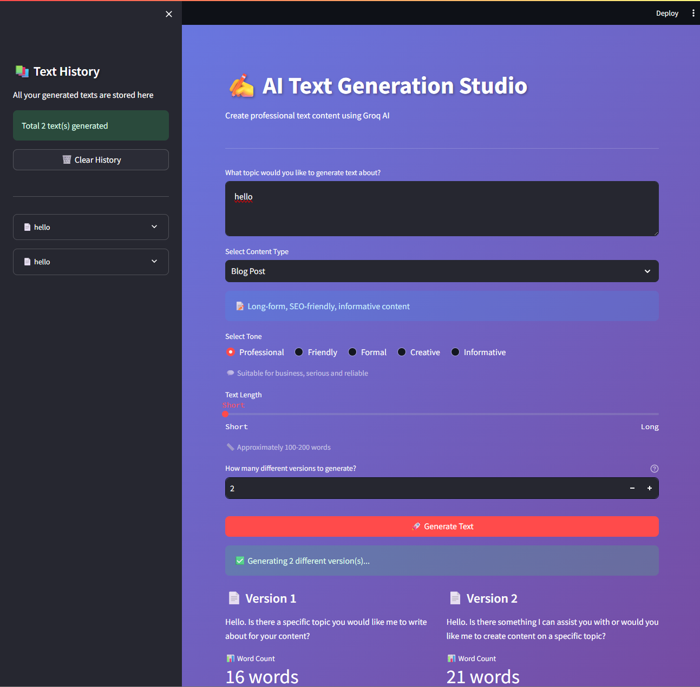
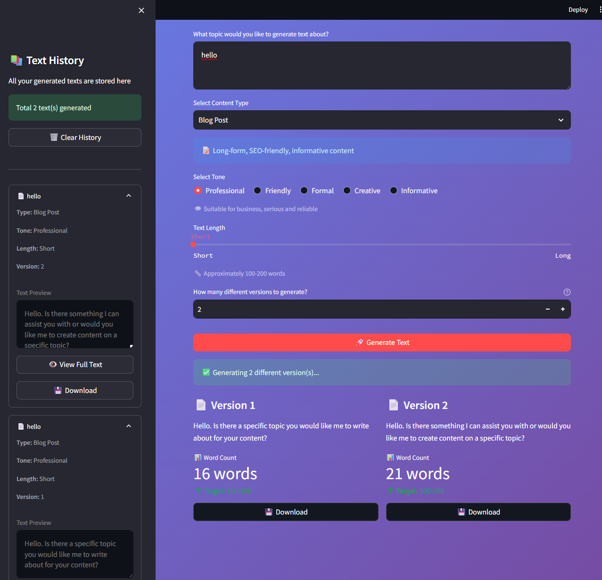
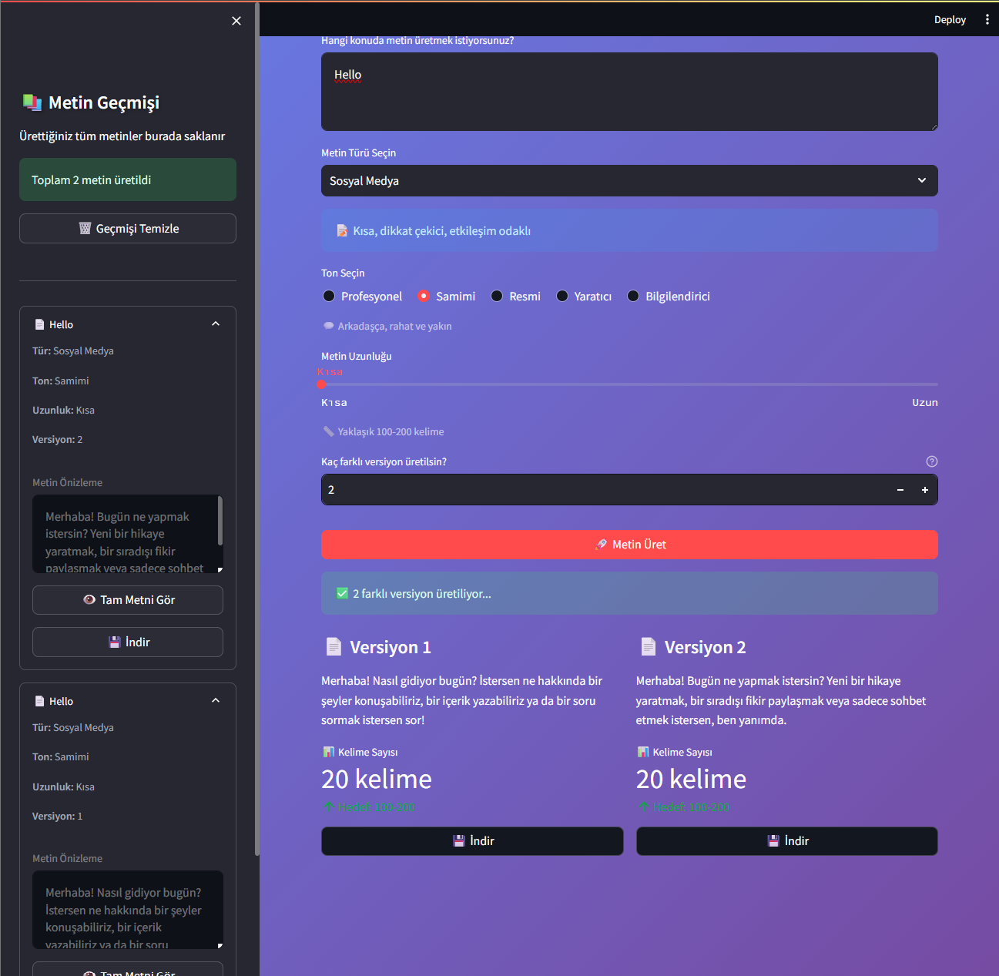

# 🤖 AI Metin Üretim Stüdyosu

Groq API ve Llama 3.1 modeli kullanarak profesyonel metin içerikleri üreten yapay zeka destekli web uygulaması.





## 📋 Proje Hakkında

AI Metin Üretim Stüdyosu, kullanıcıların farklı türlerde profesyonel metinler üretmesine yardımcı olan bir içerik oluşturma aracıdır. Blog yazılarından ürün açıklamalarına, sosyal medya içeriklerinden e-postalara kadar geniş bir yelpazede metin üretimi yapabilirsiniz.

## ✨ Özellikler

- **5 Farklı Metin Türü**: Blog yazısı, ürün açıklaması, sosyal medya, e-posta, yaratıcı yazı
- **5 Farklı Ton Seçeneği**: Profesyonel, samimi, resmi, yaratıcı, bilgilendirici
- **3 Uzunluk Seçeneği**: Kısa (100-200 kelime), Orta (300-500 kelime), Uzun (600-1000 kelime)
- **Çoklu Versiyon Üretimi**: Aynı konu için 3'e kadar farklı varyasyon
- **Metin Geçmişi**: Session içinde tüm üretilen metinleri saklama
- **TXT İndirme**: Üretilen metinleri doğrudan indirebilme
- **Kelime Sayısı Analizi**: Gerçek zamanlı kelime sayısı gösterimi

## 🛠️ Kullanılan Teknolojiler

- **Python 3.12.1**: Programlama dili
- **Streamlit**: Web arayüzü framework'ü
- **Groq API**: Hızlı LLM inference
- **Llama 3.1 70B**: Meta'nın açık kaynak AI modeli
- **python-dotenv**: Çevre değişkenleri yönetimi

## 📦 Kurulum

Projeyi yerel bilgisayarınızda çalıştırmak için:

1. Repoyu klonlayın:
```bash
git clone https://github.com/mmehmetisik/ai-text-studio.git
cd ai-text-studio
```

2. Virtual environment oluşturun ve aktifleştirin:
```bash
python -m venv venv
venv\Scripts\activate  # Windows
source venv/bin/activate  # Mac/Linux
```

3. Gerekli paketleri yükleyin:
```bash
pip install -r requirements.txt
```

4. .env dosyası oluşturun ve Groq API anahtarınızı ekleyin:
```
GROQ_API_KEY=your_api_key_here
```

5. Uygulamayı çalıştırın:
```bash
streamlit run app.py
```

## 🚀 Kullanım

1. Metin konunuzu girin
2. Metin türünü seçin (Blog, Ürün Açıklaması, vb.)
3. Ton ve uzunluk ayarlarını yapın
4. İsterseniz çoklu versiyon sayısını artırın
5. "Metin Üret" butonuna tıklayın
6. Üretilen metni indirin veya kopyalayın

## 📁 Proje Yapısı
```
ai-text-studio/
├── config/
│   └── settings.py          # Yapılandırma ayarları
├── utils/
│   ├── api_handler.py       # Groq API entegrasyonu
│   ├── text_processor.py    # Metin işleme fonksiyonları
│   └── file_exporter.py     # Dosya kaydetme işlemleri
├── assets/
│   └── style.css            # Özel CSS stilleri
├── app.py                   # Ana Streamlit uygulaması
├── requirements.txt         # Python bağımlılıkları
└── .env                     # API anahtarları (git'e eklenmez)
```

## 🔑 API Anahtarı Alma

1. [Groq Console](https://console.groq.com) adresine gidin
2. Ücretsiz hesap oluşturun
3. API Keys bölümünden yeni anahtar oluşturun
4. Anahtarı `.env` dosyanıza ekleyin

## 🎯 Öğrenme Çıktıları

Bu proje geliştirilirken şu konular öğrenildi:

- Groq API kullanımı ve hızlı LLM inference
- Streamlit ile interaktif web uygulaması geliştirme
- Session state ile kullanıcı verilerini yönetme
- Prompt engineering ve AI model parametreleri
- Git versiyon kontrolü ve GitHub entegrasyonu
- Modüler kod yapısı ve best practices

## 🤝 Katkıda Bulunma

Pull request'ler memnuniyetle karşılanır. Büyük değişiklikler için lütfen önce bir issue açarak ne değiştirmek istediğinizi tartışın.

## 📝 Lisans

Bu proje MIT lisansı altında lisanslanmıştır.

## 👨‍💻 Geliştirici

**Mehmet Işık**
- GitHub: (https://github.com/mmehmetisik)
- LinkedIn: (https://www.linkedin.com/in/mehmetisik4601/)
- Kaggle: (https://www.kaggle.com/mehmetisik)
- Medium: (https://medium.com/@mmehmetisik)

## 🙏 Teşekkürler

- [Groq](https://groq.com) - Hızlı LLM inference için
- [Meta](https://ai.meta.com/llama) - Llama 3.1 modeli için
- [Streamlit](https://streamlit.io) - Harika web framework için

---

⭐ Projeyi beğendiyseniz yıldız vermeyi unutmayın!